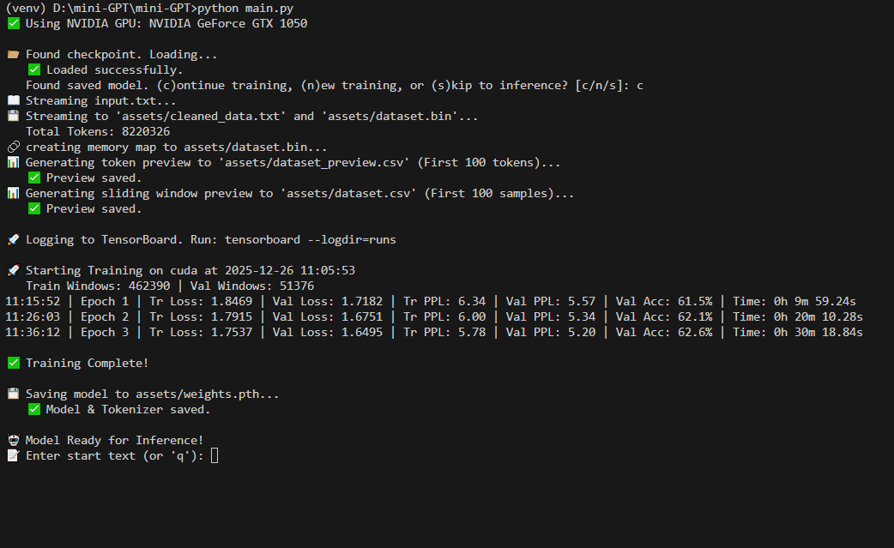

# Mini-GPT: PyTorch Implementation

A lightweight, educational implementation of a GPT-style autoregressive language model (Decoder-only Transformer) in PyTorch. 

This project demonstrates how to train a Large Language Model (LLM) on consumer hardware by using **Lazy Loading** and **Memory Mapping** to handle datasets larger than available RAM.

---
Autoregressive text generation



---

## 🚀 Key Features

* **Architecture:** GPT-2 style Decoder-only Transformer with Pre-LayerNorm and Causal Masking.
* **Lazy Loading:** Uses `np.memmap` to stream data directly from the hard drive during training. Zero RAM overhead for the dataset.
* **Tokenization:** Implements Byte-Level BPE (Byte Pair Encoding) via the Hugging Face `tokenizers` library.
* **Hardware Aware:** Automatically detects and accelerates training on:
    * NVIDIA GPUs (`cuda`)
    * Apple Silicon Macs (`mps`)
    * CPU (fallback)
* **Visualizations:** Real-time plotting of Loss and Accuracy during training.

## 🛠️ Installation & Setup

It is recommended to use a virtual environment to manage dependencies.

### ⚠️ Prerequisite: Python Version
**Important:** To use NVIDIA GPU acceleration on Windows, you must use **Python 3.10, 3.11, or 3.12**. 
* *Python 3.13 is currently **not** supported by PyTorch GPU binaries.*
* *Ensure you have the **64-bit** version of Python installed.*

### 1. Clone the Repository
```bash
git clone [https://github.com/yourusername/mini-gpt.git](https://github.com/yourusername/mini-gpt.git)
cd mini-gpt
```
### 2. Create a Virtual Environment

**On macOS / Linux:**
```bash
python3 -m venv venv
source venv/bin/activate
```

**On Windows(cmd):**
```bash
# Ensure you are using Python 3.11 or 3.12
py -3.11 -m venv venv
venv\Scripts\activate
```

### 3. Install Dependencies

**For NVIDIA GPU (Windows):**
You must install the specific CUDA-enabled version of PyTorch before other dependencies. Run this command:

```bash
pip install torch torchvision torchaudio --index-url https://download.pytorch.org/whl/cu121
# Install Remaining Libraries
pip install -r requirements.txt
```

## 🏃 Usage

### 1. Prepare Data
The model ingests raw text from a file named `input.txt` located in the root directory. You can structure this file in two ways depending on your goal:

#### Option A: Instruction/Chat Tuning
If you want to build a chatbot or assistant, structure your data using the `<user>:` and `<bot>:` markers. The model is hardcoded to recognize these special tokens during training.

**Format:**
```text
<user>: [Your Input Prompt]
<bot>: [The Desired Response]
```
Example input.txt content:
```text
<user>: what is the capital of france?
<bot>: the capital of france is paris.
<user>: write a python function to add two numbers.
<bot>: def add(a, b): return a + b
```
Note: The script automatically handles newlines and basic cleaning (lowercasing).

#### Option B: Plain Text Generation (Shakespeare/Story Mode)
If you simply want the model to complete sentences or generate stories, paste any raw text into the file.
```text
The quick brown fox jumps over the lazy dog. It was the best of times, it was the worst of times...
```
### 2. Configuration
All hyperparameters and settings are located in config.py.
```bash
# config.py

# Model Size
CONTEXT_LEN = 64        # How many previous tokens the model looks at
EMBED_DIM = 32          # Dimension of the embedding vector
NUM_LAYERS = 12         # Number of transformer blocks
NUM_HEADS = 4           # Attention heads per block
MAX_VOCAB_SIZE = 30000  # Max unique tokens BPE should create

# Training
BATCH_SIZE = 128
EPOCHS = 2
STEP_SIZE = 4           # Sliding window step (smaller = more overlapping data)

# Inference Parameters
TOP_K = 3               # Top-K sampling
TEMPERATURE = 0.6       # Sampling temperature

# Modes
INSTRUCTION_SET = True  # Set False for plain text generation
CHAT_MODE = False       # Set True to enable conversational memory (history is preserved between turns)
```

### 3. Train the Model
Run the main script to start training. The script will automatically clean the data, train the BPE tokenizer, and begin the training loop.

```bash
python main.py
```
* **Training Artifacts:**
    * `dataset.bin`: Binary memory-mapped token data.
    * `tokenizer.json`: Saved BPE tokenizer.
    * `model.pth`: Saved model checkpoint.
    * `dataset_preview.csv`: A preview of how your data is being tokenized and windowed.
 
### 3. Monitor training
To view loss curves and generation samples in real-time, run TensorBoard:
```bash
tensorboard --logdir=runs
```
